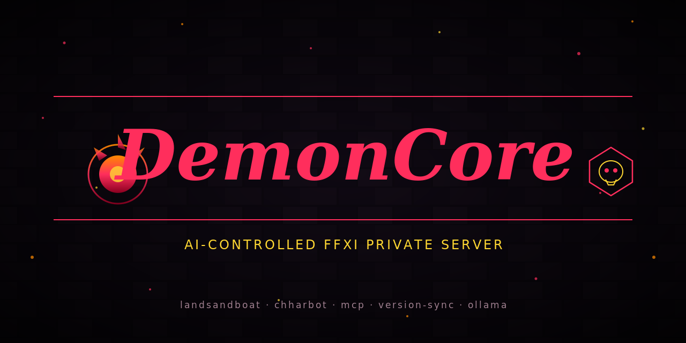

<p align="center">
  
</p>

<h1 align="center">DemonCore</h1>

<p align="center">
  <strong>AI-controlled Final Fantasy XI private server — LandSandBoat + Chharbot + MCP</strong>
</p>

<p align="center">
  <a href="https://github.com/ChharithOeun/DemonCore/stargazers"></a>
  <a href="https://github.com/ChharithOeun/DemonCore/blob/main/LICENSE"></a>
  <a href="https://www.python.org/"></a>
  <a href="https://github.com/LandSandBoat/server"></a>
  <a href="https://www.ashitaxi.com/"></a>
  <a href="https://ollama.ai/"></a>
  <a href="https://github.com/ChharithOeun/DemonCore/commits/main"></a>
</p>

<br />

<p align="center">
  <em>Everything needed to run a LandSandBoat FFXI private server that (a) auto-matches retail's <code>CLIENT_VER</code> the same day SE patches, and (b) can be observed and driven by Claude / Chharbot directly — no screenshots, no clicks. Three MCP servers expose the entire client + server surface as callable tools.</em>
</p>

---

> **⚠️ CONTACT POLICY**
>
> Please **do NOT contact me in-game** about this project. In-game tells will be ignored.
>
> - **Bugs & issues:** [GitHub Issues](https://github.com/ChharithOeun/DemonCore/issues)
> - **Feature ideas:** [GitHub Discussions](https://github.com/ChharithOeun/DemonCore/discussions)

---

## Why DemonCore?

Running a private FFXI server + AI agents is normally a spiderweb of manual steps: match retail's CLIENT_VER after every SE patch, keep xi_connect / xi_map / xi_search alive, wire a client bridge, hand-write LLM prompts, restart everything when it drifts. DemonCore collapses all of it: **one repo, three MCPs, one Python agent, zero screenshots.** A retail patch triggers a FFXiMain.dll change; a scheduled task picks up the new CLIENT_VER within 6 hours; `login.lua` is patched atomically; `login_server` bounces; the next player login works. Or just call `ffxi_admin.version_sync_run` from Claude and it happens now.

---

## The three layers, at a glance

| Layer | What it sees | What it does | Where it runs |
|---|---|---|---|
| **`ai_bridge`** (Ashita addon, Lua) | player state, chat, entities, inventory | target, send chat, face | in-process with FFXiMain.dll |
| **`lsb_admin_api`** (FastAPI sidecar) | LSB DB, map_server log | announce, teleport, give-item, spawn-mob, kick, **version sync** | next to `map_server.exe` |
| **`lsb_version_sync`** (Python module) | `FFXiMain.dll` on disk | rewrites `login.lua` atomically + bounces `login_server` | scheduled task / sidecar / MCP / CLI |

All three are wrapped by MCP servers (`mcp/ffxi_client`, `mcp/ffxi_admin`, `mcp/ffxi_chharbot`) so Claude / Chharbot can call them as tools in a fresh chat.

---

## "No clicks" bar

```
>>> ffxi_client.get_state                 # where am I / what am I doing
>>> ffxi_client.get_chat_tail {"n": 20}   # who said what
>>> ffxi_client.send_text {"text":"/sh LF help with Dynamis!"}
>>> ffxi_admin.list_players               # who's online
>>> ffxi_admin.announce {"text":"Server reset in 10 min"}
>>> ffxi_admin.version_sync_status        # retail vs configured
>>> ffxi_admin.version_sync_run           # auto-match CLIENT_VER
>>> ffxi_chharbot.plan_and_act            # let the agent decide
```

Every line above is a single MCP tool call. No screenshots parsed, no pixels clicked.

---

## Subsystem map

```
DemonCore/
├── addons/                        # in-process FFXI client plugins (Ashita)
│   ├── ai_bridge/                 # JSON-RPC listener for client state/actions
│   └── xiloader_fixed/            # Ashita addon that chain-loads xiloader 2.1.1
├── binaries/                      # verified xiloader 2.1.1 (MD5 44FE5F...)
├── chharbot/                      # local-LLM agent (Ollama or OpenAI-compatible)
│   ├── chharbot/                  # agent.py / tools.py / bridges.py / llm.py
│   ├── tests/                     # 24 pytests, offline (loopback sockets)
│   ├── bin/chharbot.ps1           # Windows launcher
│   └── pyproject.toml
├── config/                        # Ashita profile references
├── docs/                          # design + session writeups
│   ├── AI-CONTROL-ARCHITECTURE.md
│   ├── SECURITY-REVIEW.md         # 10-finding pass on v5+v6 stack
│   ├── SESSION-2026-04-*.md       # v1-v7 session logs
│   ├── DEPLOY.md
│   ├── ASHITA-INTEGRATION.md
│   └── WINDOWER-INTEGRATION.md
├── examples/                      # one-shot PowerShell deploy scripts
├── lsb_version_sync/              # auto-match retail CLIENT_VER
│   ├── lsb_version_sync/          # Python package (scanner/patcher/reloader/sync)
│   ├── tests/                     # 27 pytests (22 functional + 5 security)
│   └── pyproject.toml             # pip-installable
├── mcp/                           # MCPs Claude / Chharbot load
│   ├── ffxi_client/               # wraps ai_bridge (client-side)
│   ├── ffxi_admin/                # wraps lsb_admin_api (server-side)
│   ├── ffxi_chharbot/             # wraps Chharbot itself
│   └── mcp.example.json
└── sidecar/
    └── lsb_admin_api/             # HTTP + named-pipe sidecar next to map_server.exe
```

---

## Ecosystem

DemonCore is part of a larger FFXI stack maintained by the same author:

| Repo | Role |
|------|------|
| **[Chharizard](https://github.com/ChharithOeun/Chharizard)** | Client-side companion + HUD suite for Windower / Ashita. Grows a Server tab (v5.8.0+) that talks to DemonCore's MCP endpoints. |
| **[Chharcop](https://github.com/ChharithOeun/chharcop)** | Cross-platform scammer investigation toolkit (unrelated to FFXI). |
| **[llm-amd-windows](https://github.com/ChharithOeun/llm-amd-windows)** | Local LLM inference on AMD GPU — llama.cpp Vulkan on Windows. Powers Chharbot. |

**Retired:** `ffxi-autolaunch` — folded into DemonCore. Its launcher scripts live under `examples/`.

---

## Quick start — cold install

```powershell
# 1. Stage this repo on the live box.
git clone https://github.com/ChharithOeun/DemonCore.git F:\ffxi\deploy\repo
cd F:\ffxi\deploy\repo

# 2. Bring the retail loader chain up (first time only).
powershell -NoProfile -ExecutionPolicy Bypass `
  -File examples\install-xiloader-2.1.1.ps1
powershell -NoProfile -ExecutionPolicy Bypass `
  -File examples\finish5.ps1

# 3. Install the AI-control bridges and MCPs.
powershell -NoProfile -ExecutionPolicy Bypass `
  -File examples\deploy-ai-control.ps1

# 4. Install + schedule the version-sync module.
pip install -e lsb_version_sync
powershell -NoProfile -ExecutionPolicy Bypass `
  -File lsb_version_sync\bin\register-scheduled-task.ps1

# 5. Merge mcp/mcp.example.json into your Claude / Chharbot config.
```

From then on: a retail patch from SE triggers a FFXiMain.dll change; the scheduled task picks up the new CLIENT_VER within 6 hours; `login.lua` is patched; `login_server` is bounced; next login works. If you want it instantaneous, call `ffxi_admin.version_sync_run` from Claude.

---

## Chharbot — local-LLM agent

```powershell
# One-shot: "what's the state, then take one action"
chharbot plan-and-act

# Continuous loop with 5s decision cadence
chharbot loop --interval 5

# Point at Ollama instead of OpenAI-compatible endpoint
$env:CHHARBOT_LLM_URL = "http://127.0.0.1:11434/api/generate"
$env:CHHARBOT_LLM_MODEL = "qwen2.5:7b"
chharbot plan-and-act
```

The agent:
- Serializes player + party + target state via `ai_bridge` MCP tools
- Prompts local LLM with a system prompt tuned for the player's job
- Parses the LLM's action → routes back through `ai_bridge.send_text` or `ffxi_admin.*`
- Falls back to hardcoded rules for time-critical decisions (HP < 20%, TP overcap, etc.)
- Logs every decision + action for post-mortem review

24 pytests cover the loop, bridge protocols, and LLM adapter. Fully offline testable — no game required.

---

## Roadmap

- [x] **v1.0.0** — Rebrand, dynamic README, banner, git infrastructure, cross-link with Chharizard
- [ ] **v1.1.0** — Verify tests pass on a fresh clone; publish PyPI packages (`lsb-version-sync`, `chharbot`)
- [ ] **v1.2.0** — Chharizard.exe Server tab integration (v5.8.0 on that side) — one-click server ops from the Chharizard companion
- [ ] **v1.3.0** — Multi-agent orchestration: Chharbot on each character coordinating via shared state
- [ ] **v1.4.0** — LLM-driven NPC dialogue: replace static event scripts with generated conversation
- [ ] **v1.5.0** — Adaptive mob AI: boss reads party comp mid-fight and picks moves
- [ ] **v2.0.0** — Retail-safe mode: strip all packet injection, ship a read-only "companion" build for retail users

---

## Session history

- **v1-v2** (2026-04-20) — diagnosed and fixed the guest-password hash; identified the xiloader-version floor
- **v3** (2026-04-20) — installed verified xiloader 2.1.1 with versioned backup
- **v4** (2026-04-21) — proved end-to-end retail chain: xiloader → FFXiMain.dll → live FFXI window
- **v5** (2026-04-21) — designed the two-bridge AI control architecture; landed stub addons, sidecar, MCPs
- **v6** (2026-04-21) — built `lsb_version_sync` — the first community solution that auto-matches retail `CLIENT_VER` into LSB's `login.lua`
- **v7** (2026-04-21) — shipped `chharbot/`, a local-model agent that drives both bridges; 10-finding security pass (`docs/SECURITY-REVIEW.md`); 51 tests green

Full writeups in `docs/SESSION-*`.

---

## Contributing

Bug reports and feature ideas welcome — [open an issue](https://github.com/ChharithOeun/DemonCore/issues). PRs especially wanted for:

- Additional MCP tool wrappers
- LSB compat testing across LSB main-branch churn
- Cross-platform port (WSL/Linux with xi_* Linux builds)
- Ashita-side complements to the existing ai_bridge Lua addon
- More Chharbot rule fallbacks per job

**Do not send tells in-game.**

---

## Community & Support

<p align="center">
  <a href="https://github.com/ChharithOeun/DemonCore/discussions"></a>
  <a href="https://github.com/ChharithOeun/DemonCore/issues"></a>
  <a href="https://github.com/ChharithOeun/DemonCore/releases"></a>
</p>

---

## Support DemonCore

<p align="center">
  <a href="https://github.com/sponsors/ChharithOeun"></a>
  <a href="https://buymeacoffee.com/chharbot"></a>
</p>

DemonCore is free and open source. If it's saved you time or made your private server hum, a star costs nothing and helps other Vana'dielian sysadmins find it.

---

## Credits

- **[LandSandBoat](https://github.com/LandSandBoat/server)** — the server implementation this stack manages
- **[Ashita](https://www.ashitaxi.com/)** — v4 client loader (`ai_bridge` runs as an Ashita addon)
- **[Windower](https://www.windower.net/)** — client loader + addon framework
- **[xiloader](https://github.com/atom0s/xiloader)** by atom0s — the retail chain-loader (v2.1.1 verified MD5)
- **[Ollama](https://ollama.ai/)** — local LLM runtime that powers Chharbot
- **[FastAPI](https://fastapi.tiangolo.com/)** — the sidecar HTTP layer

**Beef policy:** none wanted. If your work appears here and you'd prefer different attribution, removal, or a specific credit format, open an issue or email `chharizard@users.noreply.github.com`.

---

## License

MIT for original code. `xiloader` and `Ashita` are the property of their respective authors; this repo bundles `binaries/xiloader-2.1.1.exe` unchanged, with MD5 `44FE5F23BF76E4E847946B5B76F1E061` published for tamper-checking.

*FFXI, PlayOnline, and related trademarks are property of Square Enix. DemonCore is not affiliated with Square Enix, LandSandBoat, Ashita, Windower, or atom0s. Use is subject to Square Enix's Terms of Service.*

---

<p align="center">
  <sub>Built by <a href="https://github.com/ChharithOeun">@Chharbot</a> — because Vana'diel deserves better tooling.</sub>
</p>

<p align="center">
  <sub><strong>Reminder: do NOT contact me in-game. Use <a href="https://github.com/ChharithOeun/DemonCore/issues">GitHub Issues</a>.</strong></sub>
</p>
